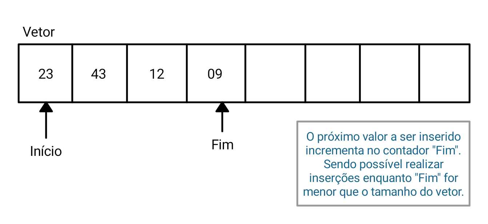
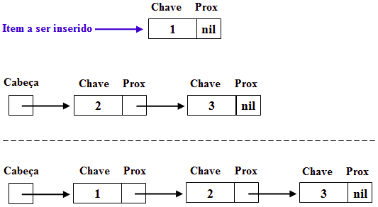

### Lista Linear
Lista linear é uma estrutura de dados na qual elementos de um mesmo tipo de dado estão organizados de maneira sequencial. Não necessariamente, estes elementos estão fisicamente em sequência, mas a idéia é que exista uma ordem lógica entre eles. Um exemplo disto seria um consultório médico: as pessoas na sala de espera estão sentadas em qualquer lugar, porém sabe-se quem é o próximo a ser atendido, e o seguinte, e assim por diante. Assim, é importante ressaltar que uma lista linear permite representar um conjunto de dados afins (de um mesmo tipo) de forma a preservar a relação de ordem entre seus elementos. Cada elemento da lista é chamado de nó, ou nodo.

### Lista Dinâmica
Várias estruturas de dados complexas podem ser criadas utilizando simultaneamente structs e ponteiros. Uma destas estruturas é a lista encadeada. Uma lista encadeada é uma seqüência de structs, que são os nós da lista, ligados entre si através de ponteiros. Esta seqüência pode ser acessada através de um ponteiro para o primeiro nó, que é a cabeça da lista. Cada nó contém um ponteiro que aponta para a struct que é a sua sucessora na lista. O ponteiro da última struct da lista aponta para NULL, indicando que se chegou ao final da lista. Esta estrutura de dados é criada dinamicamente na memória (utiliza-se malloc() e free()), de modo que se torna simples introduzir nós nela, retirar nós, ordenar os nós, etc. 

### Material Auxiliar
<a href="https://www.facom.ufu.br/~abdala/DAS5102/TEO_ListasEncadeadas.pdf">Apostila UFU</a>