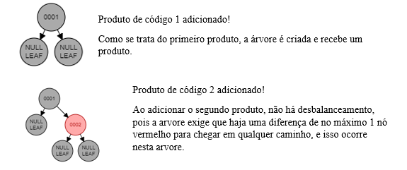
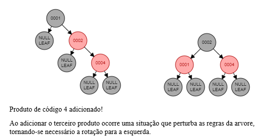
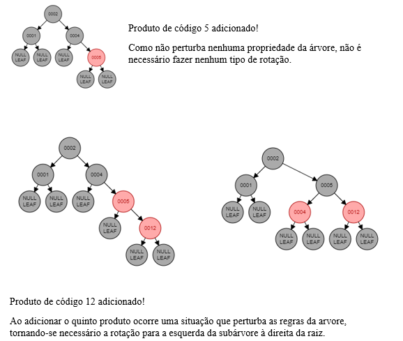
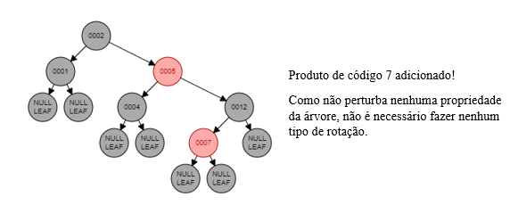
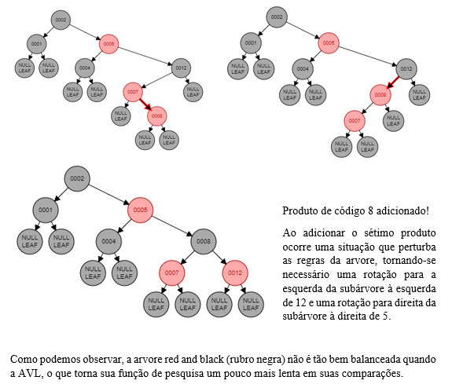

# Tree Red and Black

A Árvore red and black (rubro negra) é uma estrutura muito utilizada no mundo da programação, diferente da árvore binaria comum, ela é balanceada no momento de inserção, o que a torna mais vantajosa em termos de buscas feitas na estrutura. Ela tem semelhanças com a árvore AVL, visto que as duas são balanceadas. O que faz distinção entre as árvores é o modo em que este balanceamento é feito.
</br>
Como a árvore AVL faz um balanceamento com maior frequência, seu custo para inserção e remoção acaba sendo mais elevado comparada a rubro negra.
</br>
Para tornar possível a implementação da rubro negra seguindo todo o fundamento teórico, se torna necessário a implementação das seguintes funções:
</br>
```C
Tree* CreateTree();                                         // Que faz o ponteiro apontar para NULL, simbolizando a criação da árvore
void showTreeInOrder(Tree *tree);                           // Função responsável pela impressão dos itens da árvore de forma ordenada
bool search(Tree **node, Tree **root, Record record);       // Faz a pesquisa de um determinado item na arvore, tornando possível visualizar também sua subárvore.
int insertTree(Tree **tree, Record record);                 // Faz a inserção de um determinado item, seguindo os padrões da árvore binária (é mais uma função de gerenciamento, pois a inserção de verdade ocorre no insertNode).
int removeTree(Tree **tree, Record record);                 // Remoção do item desejado (é mais uma função de gerenciamento, pois a remoção de verdade ocorre no removetNode).
int color(Tree *tree);                                      // Recebe um determinado nó da árvore e verifica se ele aponta para NULL, se sim ele retorna BLACK, senão ele retorna a cor do nó (utilizada em comparações para contribuir no balanceamento da árvore).
void changeColor(Tree *tree);                               // Função utilizada para inverter a cor dos seus filhos e de se mesmo. 
Tree *rotationLeft(Tree *nodeA);                            // Faz uma rotação para esquerda (em um exemplo de três nós, visa deslocar um nó vermelho que esteja à direita para à esquerda).
Tree *rotationRight(Tree *nodeA);                           // Faz uma rotação para direita (em um exemplo de três nós, visa deslocar um nó vermelho que esteja à esquerda para à direita).
Tree *moveLeftRed(Tree *tree);                              // Ao rotacionar a árvore para esquerda, pode ocorrer dois nós vermelhos seguidos, o que viola as regras da estrutura. Está função faz alguns procedimentos para que isso não ocorra.
Tree *moveRightRed(Tree *tree);                             // Ao rotacionar a árvore para esquerda, pode ocorrer dois nós vermelhos seguidos, o que viola as regras da estrutura. Está função faz alguns procedimentos para que isso não ocorra.
Tree *balance(Tree *tree);                                  // Faz o controle das operações de balanceamento.
Tree *insertNode(Tree **tree, Record record, int *resp);    // Aloca espaço de memória para um novo item e verifica se há necessidade de realizar rotações. 
Tree *searchSmaller(Tree *node);                            // Procura o menor nó a partir do recebido na função.
Tree *removeSmaller(Tree *node);                            // Remove o menor elemento a partir do nó recebido na função.
Tree *removeNode(Tree *node, Record record);                // Verifica em qual possibilidade de remoção o nó se encontra e o remove.
bool vender(Tree *node, Record record, int quantidade);     // Subtrai as unidades de cada produto e caso as unidades acabem ela remove o item da arvore.
```
</br>
Com base nas propriedades da árvore rubro negra, é possível utiliza-la em sistemas que se faz uso de banco de dados. Visto que suas operações de inserção e remoção tem um menor custo computacional, se torna mais viável adaptá-la para situações em que estas operações são frequentes. 
</br>
O projeto desenvolvido trabalha com um sub sistema de compras, especificamente a parte de entrada e saída de produtos, simulando desde o momento em que o produto é cadastrado no sistema até a hora da compra. Para que um produto seja inserido na arvore, basta cadastra-lo e então, é montada a estrutura de acordo com seu código, já para ser removido, é necessário que tenha saída de todas unidades cadastradas no sistema.
</br>
Dado a entrada de 7 produtos com códigos [1,2,4,5,12,7 e 8], a arvore se comportará da seguinte maneira:











