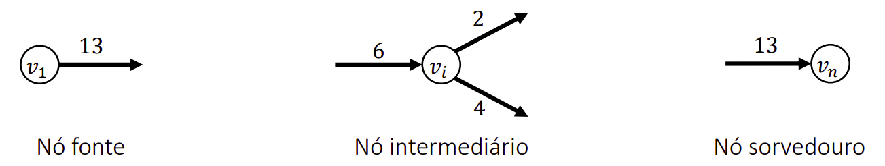
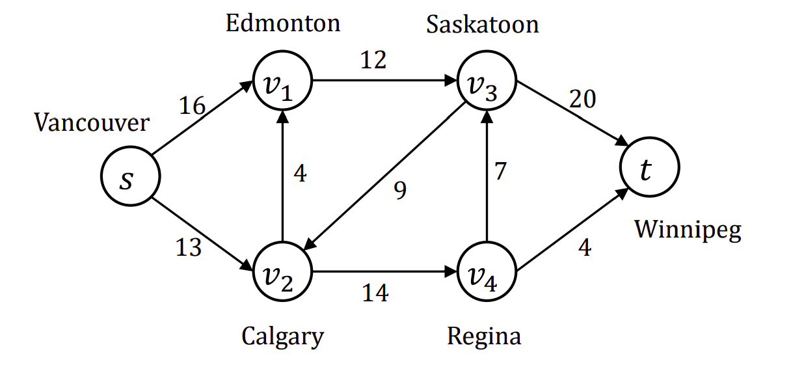
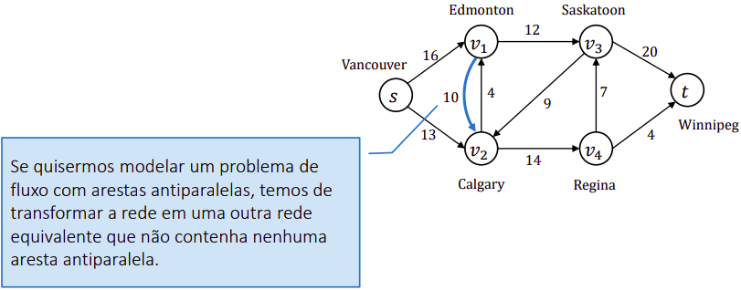
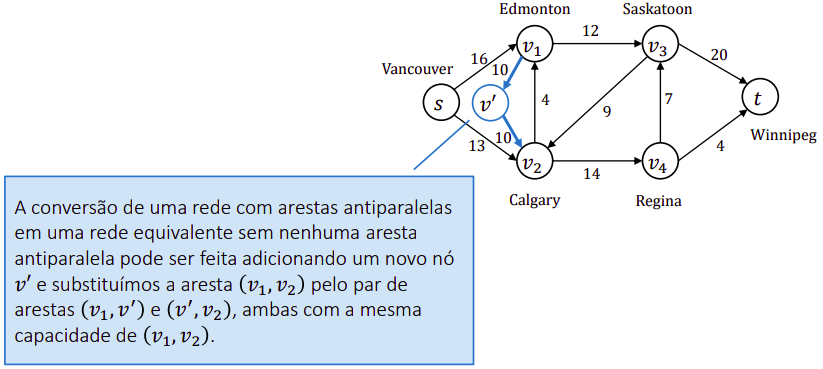
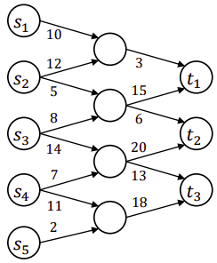
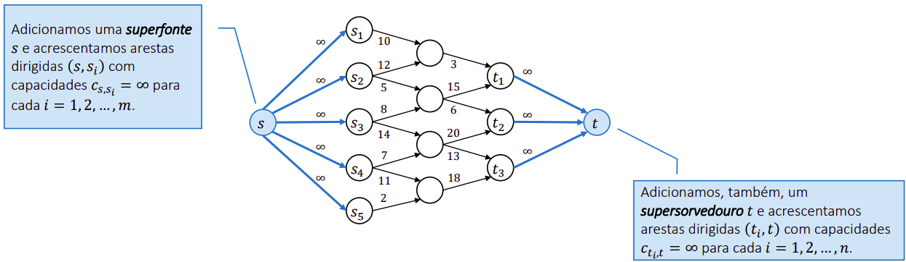

## Introduction
Os chamados problemas de fluxo abordam o processo de otimização da distribuição de materiais de
uma fonte até um sorvedouro. O “fluxo” do material em qualquer ponto no sistema é a taxa pela qual o material se move.

Para modelarmos uma rede de fluxo através de um grafo, podemos imaginar:
* Cada aresta dirigida pode ser interpretada como um conduto para o material transportado
  * Cada conduto (aresta) tem uma capacidade estabelecida, dada como a taxa máxima pela qual o material pode fluir pelo conduto.
* Os vértives (nós) podem ser interpretados como as junções de condutos e, exceto quando se trata da fonte ou sorvedouro.
  * O material flui pelos vértices sem se acumularem, ou seja, a taxa pela qual o material entra em um vértice deve ser igual à taxa pela qual ele sai do vértice (conservação de fluxo)

### Rules
1. O peso de cada aresta (fluxo) deve ser positivo
2. Não pode haver laços diretos (Ex: aresta do nó 1 para o nó 2 e arestas do nó 2 para o nó 1)
3. O grafo deve ser conexo, em que cada nó exceto 'Nó fonte' tem no mínimo uma aresta de entrada

### Problems with antiparallel edges

| Grafo original | Grafo adaptado para o problema de fluxo |
| -------------- | --------------------------------------- |
|  |  |

### Problems with multiple sources and multiple sinks

| Descrição | Grafo |
| --------- | ----- |
| Um problema de fluxo máximo pode ter várias fontes e vários sorvedouros, em vez de apenas uma unidade de
cada. Felizmente, esse problema não é mais difícil que o fluxo máximo comum. Podemos reduzir o problema de determinar um fluxo máximo em uma rede com várias fontes e vários sorvedouros a um problema de fluxo máximo comum. (Veja a imagem ao lado e sua adaptação na imagem abaixo) |  |

## Ford Fulkerson

## Referênce 
Conteúdo didático do professor <a href="https://github.com/andremaravilha?tab=repositories">André Maravilha</a>  