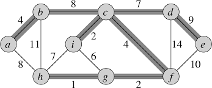

# Árvore Geradora
Uma árvore geradora (ou arvore de espalhamento) trata-se de um subgrafo que não contenha ciclos e que tenha todos os vértices do grafo gerador. Nesse contexto, este diretório focaliza no estudo de árvore geradora mínima.  

A árvore geradora mínima objetiva realizar interligações ótimas em grafos não orientados, o qual não se importa com o custo mínimo para chegar de um ponto a outro, mas sim com o custo mínimo para fazer com que todos os vértices estejam conectados a rede (árvore).  Suas maiores aplicações estão associadas a problemas de comunicação e conexão (Ex: instalação de fibra óptica).

**OBS 1:** Um grafo pode ter múltiplas árvores geradoras mínimas diferentes e de mesmo custo.  

**OBS 2:**  Esse problema pode ser solucionado utilizando de estrategias gulosas (faz a escolha do que é melhor no mometo)  que no contexto de árvore geradora, pode-se provar que alguns algoritmos realmente produzem uma árvore geradora de custo mínimo.  

Tal problema poderia ser representado e solucionado por algoritmos de programação linera inteira (como o simplex), porém como a complexidade desse algoritmo é muito alta (pode atingir custo de tempo exponencial), alguns algoritmos foram desenvolvidos para solucionar este problema, dentre eles temos os de: Kruskal, Prim e Boruvka.

## Kruskal
O algoritmo de Kruskal encontra a árvore geradora mínima em um grafo ponderado (somente pesos positivos) e não direcional. Para tal feito, esse algoritmo considera uma floresta geradora que inicializa cada nó do grafo como uma árvore. Todas as arestas do grafo original são movidas para um vetor e reordenadas de forma crescente em relação ao seu custo, em seguida, a primeira aresta 'E' é retirada do vetor de arestas para verificação. Se essa aresta 'E' conectar duas arvores diferentes, então ela faz parte do conjunto de arestas da árvore de custo mínimo, se não, ela é descartada. Esse processo é realizado até que se tenha somente uma única árvore ou até que não exista mais arcos capazes de conectar duas árvores.

    Melhor Caso: O(E log V);
    Pior Caso: O(E log V);

## Prim
O algoritmo de Prim encontra a árvore geradora mínima em um grafo ponderado (somente pesos positivos) e não direcional. Para tal feito, esse algoritmo esse algoritmo escolhe um nó inicial (O adiciona ao conjuto de nós explorados 'T') para começar a caminhar no grafo, após selecionado, todas as arestas deste nó são adicionadas a um vetor de arestas 'E', em seguida é realizada uma busca pelo menor custo no vetor de arestas 'E' que conecte algum elemento que não esteja no conjunto 'T', a aresta de menor custo é adicionada ao conjunto de nós da árvore geradora mínima e o nó descoberto por ela é verificado e adicionado ao conjuto 'T', repetindo toda essa sequência de passos até que todos os vértices (nós) tenham sido visitados.  
A complexidade desse algoritmo pode variar em razão da estrutura utilizada para a fila de prioridades

    Melhor Caso (Arranjo): O(V^2);
    Pior Caso (Arranjo): O(V^2);

    Melhor Caso (Heap): O(E log V);
    Pior Caso (Heap): O(V^2 log V);

    Melhor Caso (Heap de Fibonacci): O(E + V log V);
    Pior Caso (Heap de Fibonacci): O(V^2);

