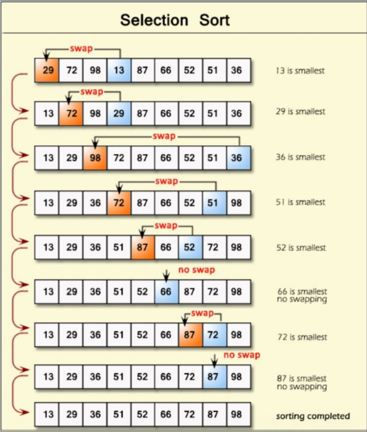

## Quadratic Complexity

#### Bubble Sort
Em uma ordenação crescente, esse algoritmo tem como ideia principal levar sempre os maiores valores para o final do vetor/array, já em ordem decrescente o algoritmo levará sempre o menor valor para a ultima posição do vetor/array. Ele verifica casa a casa e compara se o elemento reservado é o menor que a posição atual, caso seja, ele atualizará o elemento reservado com o atual e continuará caminhando até chegar na ultimaa posição ordenada ou fim do array.
<a href="https://github.com/Sr-Souza-dev/Algorithms/blob/main/Ordination/bubble_sort.hpp">ver código</a>

    Melhor Caso: O(N);
    Pior Caso: O(N^2);
    Não Recomendado para grandes conjuntos de dados
 

#### Selection Sort
Em uma ordenação crescente, esse algoritmo tem como ideia principal buscar sempre o menor valor e move-lo para o inicio, ou seja, ele procura primeiramento o menor valor presente no array e após encontra-lo, faz uma troca com a primeira posição deseordenada do array. 
<a href="https://github.com/Sr-Souza-dev/Algorithms/blob/main/Ordination/selection_sort.hpp">ver código</a>

    Melhor Caso: O(N);
    Pior Caso: O(N^2);
    Não Recomendado para grandes conjuntos de dados
 

#### Insertion Sort
Esse algoritmo (de forma grosseira) reduz o problema ao mínimo possível e ordena uma pequena sub-lista (de forma analoga ao selection sort ele pega o novo valor adicionado e começar a comparar do final da sub-lista até encontrar a posição de ordenação), após essa ordenação, ele pega o proximo elemento faltante da lista real e repete os passos até que o tamanho da lista ordenada é do mesmo tamanho da lista real.
<a href="https://github.com/Sr-Souza-dev/Algorithms/blob/main/Ordination/selection_sort.hpp">ver código</a>

    Melhor Caso: O(N);
    Pior Caso: O(N^2);
    Não Recomendado para grandes conjuntos de dados
 

#### Shell Sort
Sendo considerado um refinamento do método Insertion Sort, o Shell Sort define uma constante 'h' para definir o tamanho dos passos a serem executados. O tamanho desses passos podem ser definidos atravéz de uma heuristica suposta pelo desenvolvedor, alguns costumam começar com 'h' igual ao tamanho do vetor a ser ordenado, outros com metade desse tamanho... Após definir o tamanho de 'h', é feita uma comparação a cada dois elemento com distância 'h' sem repetir elementos, finalizando as comparações, o h é reduzido por outra heuristica que fisa encurtar o tamanho desses passo. Esta sequência é repetida até que se tenha 'h' = 1 (passos de tamanho 1), o que significa que esse algoritmo se comportará de forma similar ao insertion sort.
<a href="https://github.com/Sr-Souza-dev/Algorithms/blob/main/Ordination/shell_sort.hpp">ver código</a>

    A complexidade desse algoritmo ainda não é conhecida devido a incapacidade de encontrar uma fórmula fechada para sua função de complexidade, portanto são feitas algumas conjecturas referentes ao número de comparações para a sequeência de Knuth, sendo elas:
    Conjectura 1: O(N^1,25);
    Conjectura 2: O(N (ln N)^2);
    Recomendado para uma quantidade moderada de dados
 

#### Analysis
Você pode acessar o algoritmo que chama todos os métodos de ordenação quadrática <a href="https://github.com/Sr-Souza-dev/Algorithms/blob/main/Ordination/analysisqd.cpp">clicando aqui</a>, nele o mesmo vetor é ordenado por diversos métodos gerando uma saída de quantas interações em um laço foram gastas.

    Para simular a execução basta efetuar o download deste diretorio e abrir o terminal nesta pasta, digitando os seguintes comandos.
    1. g++ analysisqd.cpp -o analysisqd
    2. ./analysis

## Logarithmic Complexity
