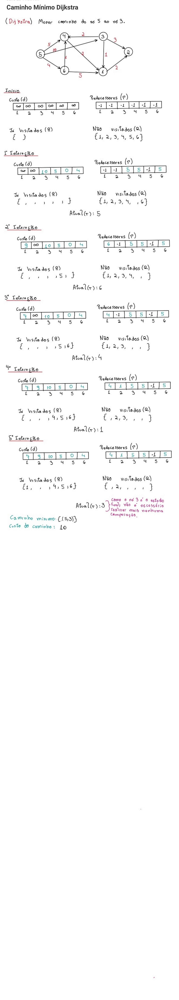

# Menor Caminho em um Grafo
O problema de caminho mínimo considera um grafo ponderado, tal que seus pesos representam o custo para caminhar de um nó ao outro. O objetivo deste problema é minimizar o custo partindo de um nó 's' até um nó 'k'.
Tal problema poderia ser representado e solucionado por algoritmos de programação linera inteira (como o simplex), porém como a complexidade desse algoritmo é muito alta (pode atingir custo de tempo exponencial), alguns algoritmos foram desenvolvidos para solucionar este problema, dentre eles temos os de: Edsger W. Dijkstra, Bellman Ford e Floyd Warshall

## Dijkstra
Esse algoritmo foi proposto em 1959 por Edsger W. Dijkstra com o intuito de encontrar o caminho mínimo de grafos ponderados com somente arcos positivos. Para tal feito, este algoritmo define algumas estruturas principais para seu funcionamento, sendo elas:

1. Conjunto R: São os nós ja visitados do grafo, ou seja, são os nós que ja se conhece e sabe-se o custo para partir dele até seus adjacentes. 
2. Conjunto Q: É o complementar de R, ou seja, são os nós que ainda não foram visitados, portanto ainda não se conhece o custo para chegar aos seus adjacentes a partir dele. 
3. Vetor D: É um vetor com o custo de um determinado nó 's' até outro nó 'i'. Esse vetor é iniciado com todos os valores tendendo ao infinito visto que a priori não se sabe o custo de nenhum caminho.
4. Vetor P: É um vetor que indica quem é o predecessor de 'i', ou seja, a partir de qual elemento eu consigo chegar em 'i' com o menor custo conhecido. 

Tendo conhecimento das estruturas acima, o algoritmo de Dijkstra inicializa com os conjuntos: R vazio e Q com todos os nós, e os vetores D e P nulos (na pratica infinito e -1). Feito isso, esse algoritmo pega o nó origem e atualiza o custo e os predecessores de seus adjacentes, em seguida, ele verifica no conjunto Q o nó de menor custo e o explora de forma similar ao nó inicial (atualizando os vetores R e Q de seus adjacentes). Esse sequência é repetida até que o nó escolinho como sendo o de menor custo for o nó destino. 

    Melhor Caso: O(N log N);
    Pior Caso: O(N^2);

## Bellman Ford
Sendo considerado uma generalização do algoritmo de Dijkstra, esse algoritmo também encontra o caminho mínimo em um grafo, diferenciando apenas com a inserção de um vetor 'H' que é responsável por contabilizar quantas vezes um determinado nó foi analizado, ou seja, com esse algoritmo é possivel encontrar o caminho mínimo de um grafo que tenha custos negativos em suas arestas (arcos) desde que não haja ciclos negativos. Para tal feito, ele caminha igualmente ao algoritmo de Dijkstra, porém quando o predecessor 'x' de um nó 'i' é atualizado e se esse nó 'i' estiver no conjunto de nós já visitados (R), então esse nó 'i' retorna para o conjunto de nós desconhecidos (Q) e acrescenta-se uma unidade no seu contador do vetor 'H'. Esse processo é realizado até que não haja mais elementos no conjunto de nós desconhecidos (Q). 

    Melhor Caso: O(V E) -> O(N^2), tal que V é a quantidade de vértices e E a quantidade de arestas;
    Pior Caso: O(N^3);

### Exemplo Caminho Mínimo (Dijkstra e Bellman Ford)

|  |  |
| -------- | ------- |

# Distância mínima entre todos os pares de nós (Floyd-Warshall)
Para encontrar a distância mínima de todos para todos pode-se utilizar tanto o algoritmo de Dijkstra (com custo O(N^3)) quanto o algoritmo de Bellman-Ford(com custo O(N^4)) se executado N vezes. 

Para solucionar esse problema, foi proposto um algoritmo em 1962 por Robert Floyd baseado no algoritmo de Stephen Warshall que é capaz de calcular a distância mínima entre todos os pares de nós possíveis no grafo analisado. Trata-se de um algoritmo de programação dinâmica bottom-up (utiliza de soluções ótimas já encontradas de casos menores para encontrar soluções ótimas do macro) que funciona até mesmo com arcos com custos negativos (desde que não haja ciclos com custos negativos).

Para tal feito, esse algoritmo utiliza de duas matrizes, sendo uma de Custos (D) e outra de predecessores (P). Feito isso, um valor inicial é atribuido a uma variável 'K' que auxiliará no calculo do custo do caminhamento pelo grafo. Iniciando K = 0, tem-se a matriz inicializada com todas as relações diretas do grafo (todo custo de nós adjacentes é setado na matriz de custo e consequentemente seu predecessor), ao incrementando 1 ao valor de K (K=1) o próximo passo do algoritmo é encontrar todos os caminhos que passam somente pelo nó 1 (tem somente o nó 1 como intermediário). De forma simplificada, é possível encontar esses caminhos realizando apenas a analise das matrizes, tal que se d{i,j} > d{i,k} + d{k,j}, então o valor do custo é atualizado para o novo caminho passando por 'K' e o predecessor assume o menor custo conhecido. Esse processo é repetido N, resultando no fim uma matriz com todos os custos mínimos entre dois nós.

    Melhor Caso: O(N^3);
    Pior Caso: O(N^3);

 
É importante que se visualize a imagem abaixo para um melhor entendimento do algoritmo. 

