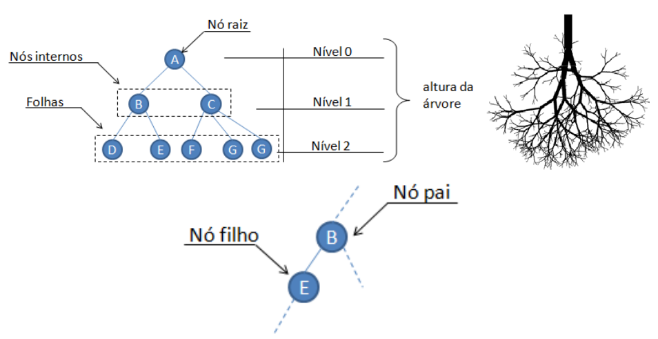
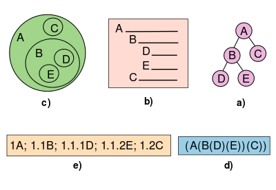

## Introdução
Na ciência da computação, uma árvore é um tipo de dados abstrato amplamente utilizado que representa uma estrutura de árvore hierárquica com um conjunto de nós conectados. Cada nó na árvore pode ser conectado a muitos filhos (dependendo do tipo de árvore), mas deve ser conectado exatamente a um pai, exceto ao nó raiz, que não tem pai. Essas restrições significam que não há ciclos ou "loops" (nenhum nó pode ser seu próprio ancestral) e também que cada filho pode ser tratado como o nó raiz de sua própria subárvore, tornando a recursão uma técnica útil para travessia de árvore. 

Uma árvore é formada por um conjunto de elementos que armazenam informações chamados nodos ou nós. Toda a árvore possui o elemento chamado raiz, que possui ligações para outros elementos denominados ramos ou filhos. Estes ramos podem estar ligados a outros elementos que também podem possuir outros ramos. O elemento que não possui ramos é conhecido como nó folha, nó terminal ou nó externo.

---
## Representação
Há diversas formas de representação de uma árvore: hierárquica, diagrama de inclusão, diagrama de barras, numeração por níveis, por aninhamento.

A **hierárquica** é parecida com um organograma de uma empresa, linhas unem dois nodos e indicam o relacionamento lógico entre eles. Tradicionalmente desenha-se a raiz na parte superior e todos os nodos subordinados na parte inferior, mas o contrário também é possível. Na figura abaixo, o item (**a**) é um exemplo desta representação.

**Diagrama de inclusão**, um círculo representa cada nodo e seus nodos descendentes são inseridos dentro do círculo de seus pais. Também conhecida como diagrama de *Venn*, é muito utilizada na representação de conjuntos. O item (**c**) da figura ao lado mostra a árvore do item (a) usando diagrama de inclusão.

Em um **diagrama de barras**, linhas são usadas para mostrar a hierarquia dos nodos. A raiz possui a linha de maior tamanho e os nodos irmãos possuem linhas de tamanhos iguais. Método bastante utilizado na criação de índices de livros. É similar à indentação usada em linguagens de programação. O item (**b**) da imagem ao lado indica como seria a árvore do item (a) usando essa representação.

Usando **numeração por níveis** o nodo raiz recebe o número um e todos os nodos seguintes recebem uma numeração sequencial, sempre antecedidos pela numeração de seus nodos superiores. Item (**e**) da figura à direita representa a árvore (a) com representação por níveis.

Na **representação por aninhamento**, também conhecida por "representação por parênteses aninhados", a sucessão de parênteses reproduz as relações entre os nodos, aninhando um nodo filho ao seu pai. Como exemplo temos o item (**d**) da imagem ao lado representando a árvore (a).

---
## Terminologia
Um **nó** é uma estrutura que pode conter dados e conexões com outros nós, às vezes chamados de **arestas** ou **links**. Cada nó em uma árvore tem zero ou mais nós **filhos**, que estão abaixo dele na árvore (por convenção, as árvores são desenhadas com descendentes descendo). Um nó que tem um filho é chamado de nó **pai** do filho (ou superior). Todos os nós têm exatamente um pai, exceto o nó **raiz** mais alto , que não tem nenhum. Um nó pode ter muitos nós ancestrais, como o pai do pai. Nós filhos com o mesmo pai são nós **irmãos**. Algumas definições permitem que uma árvore não tenha nenhum nó, nesse caso ela é chamada de vazia .

Um **nó interno** (abreviação de inode ou nó de ramificação) é qualquer nó de uma árvore que tenha nós filhos. Da mesma forma, um **nó externo** (nó folha ou nó terminal) é qualquer nó que não tenha nós filhos.

A **altura de um nó** é o comprimento do caminho descendente mais longo para uma folha desse nó. A altura da raiz é a **altura da árvore**. A **profundidade de um nó** é o comprimento do caminho até sua raiz (ou seja, seu caminho raiz). Ao usar a contagem baseada em zero, o nó raiz tem profundidade zero, os nós folha têm altura zero e uma árvore com apenas um único nó (portanto, raiz e folha) tem profundidade e altura zero. Convencionalmente, uma árvore vazia (árvore sem nós, se permitidos) tem altura -1.

Cada nó não raiz pode ser tratado como o nó raiz de sua própria **subárvore**, que inclui esse nó e todos os seus descendentes. 

Outros termos usados ​​com árvores:
* Vizinho: Pai ou filho.
* Antepassado: Um nó alcançável por procedimentos repetidos de filho para pai.
* Descendente: Um nó alcançável por procedimentos repetidos de pai para filho. Também conhecido como subfilho.
* Grau: Para um determinado nó, seu número de filhos. Uma folha tem necessariamente grau zero.
* Grau de árvore: O grau de uma árvore é o grau máximo de um nó na árvore.
* Distância: O número de arestas ao longo do caminho mais curto entre dois nós.
* Nível: O nível de um nó é o número de arestas ao longo do caminho único entre ele e o nó raiz. Isso é o mesmo que a profundidade ao usar a contagem baseada em zero.
* Largura: O número de nós em um nível.
* Largura da árvore: O número de folhas.
* Floresta: Um conjunto de uma ou mais árvores disjuntas.
* Árvore ordenada: Uma árvore enraizada na qual uma ordenação é especificada para os filhos de cada vértice. O livro The Art of Computer Programming usa o termo árvore orientada. 
* Tamanho de uma árvore: Número de nós na árvore.

---
## Referências
<a href="https://pt.wikipedia.org/wiki/%C3%81rvore_(estrutura_de_dados)#cite_note-celes_cer_ran-4">Árvores<a>
<a href="https://en.wikipedia.org/wiki/Tree_(data_structure)">Tree<a>