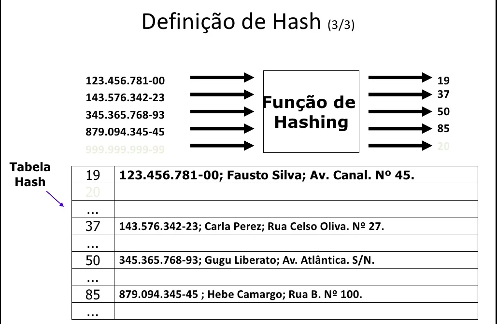
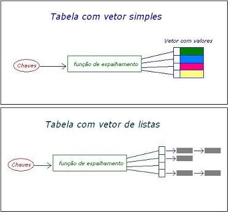
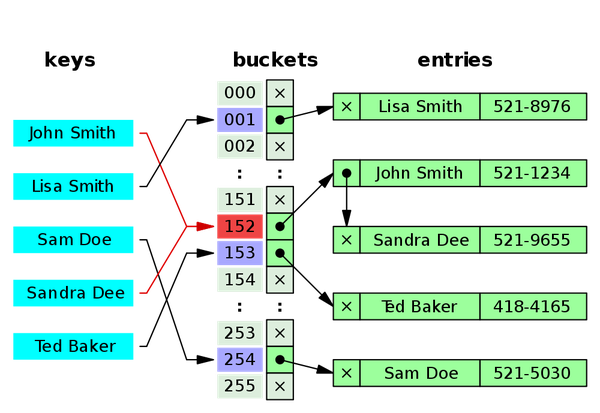

## Introdução
Em ciência da computação, uma tabela de dispersão (também conhecida por tabela de espalhamento ou tabela hash, do inglês hash) é uma estrutura de dados especial, que associa chaves de pesquisa a valores. Seu objetivo é, a partir de uma chave simples, fazer uma busca rápida e obter o valor desejado. Para isso, ela considera uma função hash (também conhecida como função de espalhamento, função de dispersão ou função de mapeamento) que faz a conversão de determinada chave em um endereço direto de acesso ao valor desejado. A implementação típica busca uma função de dispersão que seja de complexidade O(1), não importando o número de registros na tabela (desconsiderando colisões).

    Melhor Caso de CRUD: O(1)
    Pior Caso de CRUD: O(n)

---
### Função de espalhamento
A função de espalhamento ou função de dispersão é a responsável por gerar um índice a partir de determinada chave. Caso a função seja mal escolhida, toda a tabela terá um mau desempenho.

O ideal para a função de espalhamento é que sejam sempre fornecidos índices únicos para as chaves de entrada. A função perfeita seria a que, para quaisquer entradas A e B, sendo A diferente de B, fornecesse saídas diferentes com custo computacional uniforme. Quando as entradas A e B são diferentes e, passando pela função de espalhamento, geram a mesma saída, acontece o que chamamos de colisão.

Na prática, funções de espalhamento perfeitas ou quase perfeitas são encontradas apenas onde a colisão é intolerável (por exemplo, nas funções de dispersão da criptografia), ou quando conhecemos previamente o conteúdo da tabela armazenada. Nas tabelas de dispersão comuns a colisão é apenas indesejável, diminuindo o desempenho do sistema. Muitos programas funcionam sem que seu responsável suspeite que a função de espalhamento seja ruim e esteja atrapalhando o desempenho.

Por causa das colisões, muitas tabelas de dispersão são aliadas com alguma outra estrutura de dados, tal como uma lista encadeada ou até mesmo com árvores balanceadas. Em outras oportunidades a colisão é solucionada dentro da própria tabela.

---
### Colisões
A função de dispersão pode calcular o mesmo índice para duas chaves diferentes, uma situação chamada colisão. Por conta disso, a função deve ser projetada para evitar ao máximo a ocorrência de colisões. Por mais bem projetada que seja a função de dispersão, sempre haverá colisões. A estrutura de dispersão utiliza mecanismos para tratar as colisões, que dependem de características da tabela usada. Tal que um bom método de resolução de colisões é essencial, não importando a qualidade da função de espalhamento.

| Tipos | Imagem |
| ----- | ------ |
| Para desviar das colisões, há duas abordagens comuns, sendo elas: endereçamento aberto e encadeado. |  |

#### Endereçamento aberto
No método de endereçamento aberto os registros em conflito são armazenados dentro da própria tabela de dispersão. A resolução das colisões é realizada através de buscas padronizadas dentro da própria tabela. A forma mais simples de fazer a busca é procurar linearmente na tabela até encontrar um registro vazio ou o registro buscado. Outras formas utilizadas incrementam o índice exponencialmente: caso o registro não seja encontrado na décima posição, será buscado na centésima, depois na milésima. A inserção tem que seguir o mesmo critério da busca. Outra forma mais complexa de implementar o endereçamento aberto é criar uma nova função de espalhamento que resolva o novo conflito (também chamado de dispersão dupla). Na prática, o que acontece nesse caso é que o vetor da tabela é formado por uma seqüência de funções de espalhamento auxiliares, em que a chave de entrada será o valor gerado pela função anterior. Esse tipo de implementação pode ser útil em casos muito específicos, com enormes quantidades de dados, mas normalmente a sobrecarga não justifica a experiência.

#### Encadeamento
A informação é armazenada em estruturas encadeadas fora da tabela de dispersão. Encontra-se uma posição disponível na tabela e indicamos que esta posição é a que deve ser buscada em seguida. Os mais conhecidos são encadeamento separado e endereçamento aberto.

O encadeamento separado é a solução mais simples, em que normalmente um registro aponta para uma lista encadeada em que são armazenados os registros em conflito. A inserção na tabela requer uma busca e inserção dentro da lista encadeada; uma remoção requer atualizar os índices dentro da lista, como se faria normalmente. Estruturas de dados alternativas podem ser utilizadas no lugar das listas encadeadas. Por exemplo, se utilizarmos uma árvore balanceada, podemos melhorar o tempo médio de acesso da tabela de dispersão para  O(logn) ao invés de O(n). Mas como as listas de colisão são projetadas para serem curtas, a sobrecarga causada pela manutenção das árvores pode fazer o desempenho cair. Apesar disso, as árvores podem ser utilizadas como proteção contra ataques que buscam criar sobrecarga propositalmente - descobrindo uma forma da função gerar repetidamente o mesmo índice - e derrubar o sistema (ataques DOS). Nesse caso, uma árvore balanceada ajudaria o sistema a se manter estável, por ser uma estrutura com grande capacidade de crescimento.

### Referência
<a href="https://pt.wikipedia.org/wiki/Tabela_de_dispers%C3%A3o#:~:text=Em%20ci%C3%AAncia%20da%20computa%C3%A7%C3%A3o%2C%20uma,e%20obter%20o%20valor%20desejado.">Tabela Hash (Tabela de dispersão)</a>